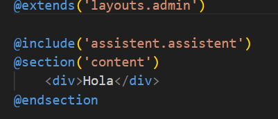
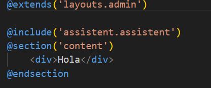

English

SAI (Intelligent Assistance System)

SAI is a PHP library that allows you to create virtual assistants based on ChatGPT for applications. With SAI, you can control the functions of the application through natural language, enabling users to perform complex tasks more efficiently.

Installation

To install SAI, run the command `composer require assistent/sai` in your project.

Once the library is installed, run the following command:

`php artisan sai:install`

```
php artisan storage:link
```

Remember to configure this variable in your .env file:

```
OPENAI_API_KEY = "tu api key"
OPENAI_MODEL = "gpt-3.5-turbo" //puedes poner cualquier modelo
OPENAI_MAX_TOKEN = 200
```

With that, everything will be ready, and an automatic chat will be created, which will have integrated ChatGPT and the additional functionalities you wish to create.

In the view where you want to include the chat as a floating window, add:



`@include('assistent.assistent)`

This will make the chat button appear as a floating element.

**Principles**

In the file `app/Principles/Principles.php`, you can add all the prompts you need for the service to recognize.

```
class Principles extends SaiPrinciples {
    public function __invoke()
    {
  
        return array_merge(
            array_map(function ($principle) {
                return $principle;
            }, $this->default),
            [
                //Add the principles you want to use, implement your prompts correctly
                'You are the virtual assistant of the company gglass'
            ]);
    }
}

```

**Directives**

Define the method you want to call and an array with possible messages that the user could use to call that function.

In `app/config/sai.php`:

```
"methods"=> [
        [
            "method"=> "GetFunctions",
            "messages"=>[
                "What functionalities do you have?",
                "Show me what you can do",
                "Show me your functionalities",
                "Tell me what you can do",
                "What functionalities do you have programmed?"
            ]
        ]
    ]

```

Then create the directive in `app/Directive/Methods`:

```
<?php

namespace App\Directives\Methods;

use Assistent\Directives\Implementations\DirectivesAnswers;

class GetFunctions implements DirectivesAnswers
{
    public function outPut($input)
    {
        return [
            "message" =>[
            "1. You can ask me about your data, your name, your identification, your email, or your creation date - status: Finished",
            "2. Update user password - status: In development",
            "3. Update user email - status: In development",
            ]
        ];
    }
}

```

Description

SAI is a powerful tool for creating virtual assistants that can understand natural language and perform complex tasks in  applications. With its simple installation process and flexible configuration options, SAI enables developers to create intelligent and efficient chatbots that can enhance the user experience.

The installation process of SAI is straightforward and can be completed in just a few steps. Once installed, developers can configure the library to work with their specific SaaS application and customize its functionality as needed.

SAI is built on ChatGPT, which is a state-of-the-art natural language processing tool that allows virtual assistants to understand and respond to user requests. With SAI, developers can harness the power of ChatGPT to create virtual assistants that can interact with users in a natural and intuitive way.

Overall, SAI is an excellent tool for developers looking to create virtual assistants for their applications. Its powerful functionality and ease of use make it an ideal choice for any project that requires intelligent and efficient chatbots.

Español

SAI (Sistema de Asistencia Inteligente)

SAI es una librería de PHP que te permite crear asistentes virtuales basados en ChatGPT para aplicaciones SaaS. Con SAI, puedes controlar las funciones de la aplicación a través del lenguaje natural, lo que permite a los usuarios realizar tareas complejas de manera más eficiente.

Instalación

Para instalar SAI, ejecuta el comando composer require assistent/sai en tu proyecto.

```json
composer require assistent/sai
```

Una vez instalada la librería, ejecuta el siguiente comando:

```
php artisan sai:install
```

```
php artisan storage:link
```

Recuerda configurar esta variable en tu archivo .env:

```
OPENAI_API_KEY = "tu api key"
OPENAI_MODEL = "gpt-3.5-turbo" //puedes poner cualquier modelo
OPENAI_MAX_TOKEN = 200
```

Con eso, todo estará listo, y se creará automáticamente un chat que tendrá integrado ChatGPT y las funcionalidades adicionales que desees crear.

En la vista en la que desees incluir el chat como una ventana flotante añade



```
@include('assistent.assistent)
```

con eso aparecera flotando el boton del chat

**Principios**

en el archivo, app/Principles/Principles.php, pueden añadir todos los prompt que necesites para que el servicios los reconozca.

```
class Principles extends SaiPrinciples {
    public function __invoke()
    {
    
        return array_merge(
            array_map(function ($principle) {
                return $principle;
            }, $this->default),
            [
                //Aqui va los principios que desees usar, implemente bien tus promt
                'Eres el asistente virtual de la empresa gglass'
            ]);
    }
}
```

**Directivas**

define el metodo que deseas llamar, y un array con los posibles mensajes que podria utilizar el usuario para llamar a esa función.

app/config/sai.php

```
"methods"=> [
        [
            "method"=> "GetFunctions",
            "mensajes"=>[
                "Que funcionalidades tienes?",
                "muestrame que puedes hacer",
                "muestrame tus funcionalidades",
                "dime que peudes hacer",
                "que funcionalidades tienes programadas?"
            ]
        ]
    ]
```

Luego crea la directiva en app/Directive/Methods

```
<?php

namespace App\Directives\Methods;

use Assistent\Directives\Implementations\DirectivesAnswers;

class GetFunctions implements DirectivesAnswers
{
    public function outPut($input)
    {
        return [
            "message" =>[
            "1. puedes preguntarme por tus datos, tu nombre, tu identificación, tu email, o tu fecha de creación - estado:Terminada",
            "2. Actualizar contreña de usuario - estado: En desarrollo",
            "3. Actualizar email de usuario - estado: En desarrollo",
            ]
        ];
    }
}
```

Descripción

SAI es una herramienta potente para crear asistentes virtuales que pueden entender el lenguaje natural y realizar tareas complejas en aplicaciones. Con su proceso de instalación sencillo y sus opciones de configuración flexibles, SAI permite a los desarrolladores crear chatbots inteligentes y eficientes que pueden mejorar la experiencia del usuario.

El proceso de instalación de SAI es sencillo y puede realizarse en solo unos pocos pasos. Una vez instalado, los desarrolladores pueden configurar la librería para que funcione con su aplicación  y personalizar su funcionalidad según sea necesario.

SAI se basa en ChatGPT, que es una herramienta de procesamiento de lenguaje natural de última generación que permite a los asistentes virtuales entender y responder a las solicitudes de los usuarios. Con SAI, los desarrolladores pueden aprovechar el poder de ChatGPT para crear asistentes virtuales que puedan interactuar con los usuarios de manera natural e intuitiva.

En general, SAI es una excelente herramienta para los desarrolladores que desean crear asistentes virtuales para sus aplicaciones. Su funcionalidad potente y facilidad de uso lo convierten en una opción ideal para cualquier proyecto que requiera chatbots inteligentes y eficientes.
